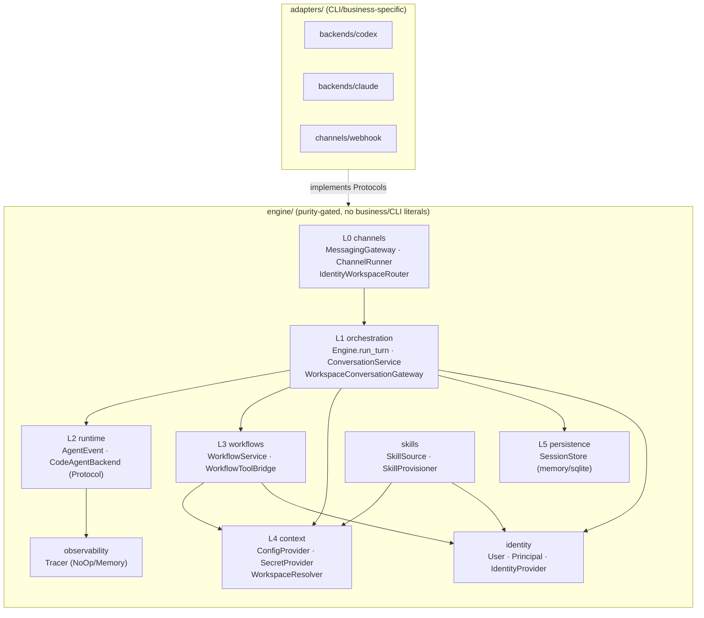

# claw_engine — Architecture

> A business-zero-knowledge engine for code-agent CLIs. Read this if you want to extend the engine, write a new adapter, or understand the security invariants.

## TL;DR

```
   ┌───────────────────────────  engine/  (business-zero-knowledge, purity-gated)  ──────────────────┐
   │                                                                                                │
   │   L0  channels/         MessagingGateway · IncomingMessage · ReplyTarget · ChannelRunner       │
   │                         IdentityWorkspaceRouter · StaticWorkspaceRouter                         │
   │                                                                                                │
   │   L1  orchestration/    Engine.run_turn (stateless, traced)                                    │
   │                         ConversationService (session, dedup, max_rounds, failure-retriable)    │
   │                         WorkspaceConversationGateway (resolve workspace → call convo)           │
   │                                                                                                │
   │   L2  runtime/          AgentEvent · AgentRunRequest · AgentRunResult · CodeAgentBackend       │
   │                         (Protocol — implementations live in adapters/)                          │
   │                                                                                                │
   │   L3  workflows/        WorkflowService · WorkflowRun · Executor · WorkflowToolBridge          │
   │                                                                                                │
   │   L4  context/          ConfigProvider · SecretProvider · UserConfigProvider                   │
   │                         WorkspaceResolver → ResolvedWorkspace                                  │
   │                                                                                                │
   │   L5  persistence/      Session · SessionStore (memory + sqlite)                               │
   │                                                                                                │
   │   ⟂   identity/         User · Principal · IdentityProvider (RBAC, default-allow)              │
   │   ⟂   observability/    Tracer · TraceSpan · TraceDims (NoOp + Memory; redaction enforced)     │
   │   ⟂   skills/           SkillSource · SkillProvisioner (manifest-backed revocation)            │
   │                                                                                                │
   └────────────────────────────────────────────────────────────────────────────────────────────────┘
                                          ▲
                                          │  (dependency direction: adapters → engine)
                                          │
   ┌────────────────────────  adapters/  (CLI/business-specific impls)  ─────────────────────────────┐
   │   backends/   codex/  claude/   _subprocess.py   _errors.py                                    │
   │   channels/   webhook/                                                                         │
   │   (future)    observability/langfuse  ·  workflows/mcp_transport  ·  skills/git_source  ·     │
   │               persistence/mysql_store  ·  identity/sso                                         │
   └────────────────────────────────────────────────────────────────────────────────────────────────┘
```

Same architecture as a Mermaid diagram (rendered on GitHub):



The arrows that don't appear: `engine → adapters`. **That edge is forbidden and CI-enforced.**

---

## The 5 seams

A "seam" is a `Protocol` defined in `engine/` whose concrete implementations live in `adapters/` (or in `engine/` for V1 hermetic helpers like `InMemoryIdentityProvider`).

### ① `MessagingGateway` — inbound parse + outbound delivery

`engine/channels/contracts.py`

```python
class MessagingGateway(Protocol):
    def verify_inbound(self, raw: str, headers: Mapping[str, str]) -> None: ...  # raises InboundAuthError
    def parse_inbound(self, raw: str) -> IncomingMessage: ...
    def send_text(self, target: ReplyTarget, text: str) -> None: ...
    def send_attachments(self, target: ReplyTarget, files: tuple[str, ...]) -> None: ...
    def start_progress(self, target: ReplyTarget, steps: tuple[str, ...]) -> ProgressHandle: ...
    def update_progress(self, handle: ProgressHandle, state: ProgressState) -> None: ...
```

`IncomingMessage` is minimal by design: `{channel, raw_user_ref, external_thread_key, text, message_id, attachments, is_command}`. `raw_user_ref` is opaque; it's the `IdentityProvider`'s job to resolve it into a `User`.

V1 ships `adapters/channels/webhook.py`: HMAC-SHA256 signature verification (case-insensitive headers), JSON parse with attachments type check, capture-style send (no real HTTP server — hermetic).

### ② `CodeAgentBackend` — wrap a code-agent CLI behind a unified event stream

`engine/runtime/contracts.py`

```python
class CodeAgentBackend(Protocol):
    name: str
    def capabilities(self) -> BackendCapabilities: ...
    def run(self, request: AgentRunRequest) -> Iterator[AgentEvent]: ...
    def healthcheck(self) -> BackendHealth: ...
```

The event stream is closed under a tagged union (`AgentEventKind` = `THREAD_STARTED | MESSAGE_DELTA | MESSAGE_COMPLETED | TOOL_CALL_STARTED | TOOL_CALL_COMPLETED | TURN_COMPLETED | ERROR`). Backends translate native CLI events into these. `TURN_COMPLETED` carries an `AgentRunResult`; `ERROR` carries an `AgentError` from a closed taxonomy (`AUTH | TIMEOUT | RATE_LIMIT | BACKEND_CRASH | PROTOCOL | CANCELLED`).

V1 ships codex and claude backends in `adapters/backends/`. Both pass the **same** shared contract suite (`tests/contract/test_backend_contract.py`) — 5 behavioral cases × 2 backends = 10 tests that prove the unification is real.

**Hardening notes** (lessons from algo-bot codex backend):
- Non-JSON / schema-broken lines → `ERROR(PROTOCOL)`, never silent skip.
- Known type with missing required field → `ERROR(PROTOCOL)`. (e.g. `thread.started` without `thread_id`)
- Unknown valid JSON `type` → ignored (forward compatible).
- Timeout / subprocess crash → caught and mapped to `ERROR(TIMEOUT)` / `ERROR(BACKEND_CRASH)`. Narrow except (no blind `Exception`), so logic bugs don't get masked.

### ③ `IdentityProvider` — who's calling, what can they do

`engine/identity/contracts.py`

```python
class IdentityProvider(Protocol):
    def resolve_user(self, raw_user_ref: str) -> User: ...                              # raises UnknownUser
    def authorized_workspaces(self, user: User) -> tuple[str, ...]: ...
    def can_access_workspace(self, user: User, workspace_id: str) -> bool: ...
    def can_use_skill(self, user: User, workspace_id: str, skill: str) -> bool: ...     # default-allow
    def can_run_workflow(self, user: User, workspace_id: str, workflow: str) -> bool: ...  # default-allow
```

`User = {user_id, display_name, roles, default_workspace}`. `Principal = {user, workspace_id}` is the unit of authorization for skill/workflow operations.

Default-allow semantics: a skill or workflow not in the per-user `denied_*` set is permitted (provided it's in the workspace's allowed list). This composes a two-layer model — `WorkspaceSpec.allowed_skills/workflows` (workspace whitelist) ∩ `can_use_skill/can_run_workflow` (user-level deny).

V1 ships `InMemoryIdentityProvider` in `engine/identity/memory.py`. Real SSO/LDAP goes in `adapters/identity/`.

### ④ `WorkspaceDataSource` *(reserved for V2)*

V1 keeps it minimal: `cwd = workspaces_root / workspace_id` (path-traversal guarded by `_validate_workspace_id`). No git sync, no CSV ingest. A future adapter would populate the workspace directory before `Engine.run_turn` consumes it.

### ⑤ `PromptProvider` *(reserved for V2)*

V1 expects the caller to pass `prompt` text directly to `Engine.run_turn`. A future seam would assemble per-workspace persona prompts (the algo-bot case) without changing engine code.

Plus there are auxiliary seams (also `Protocol`s in `engine/`):

- **`ConfigProvider`** (2-layer env: global + workspace).
- **`SecretProvider`** (separate seam, distinct from config).
- **`UserConfigProvider`** (`(user_id, workspace_id)` keyed to prevent cross-workspace leakage).
- **`SessionStore`** (memory + sqlite ship; mysql goes in adapters).
- **`Tracer`** (NoOp default; Memory for tests; Langfuse adapter pending).
- **`WorkflowStore`** / **`WorkflowExecutor`** (memory + inline ship; thread pool ships).
- **`SkillSource`** (`LocalDirSkillSource` ships; git source pending).

---

## Dependency rules (CI-enforced)

`tests/purity/test_engine_purity.py` asserts:

1. **No adapter import in `engine/`.** AST-scans every `.py` under `claw_engine/engine/`; fails if any `import` resolves to `adapters.*`.
2. **No business / CLI literal in `engine/`.** Substring-scans for the forbidden set: `seatalk`, `jira`, `codex`, `claude`. These names may appear only in `adapters/` and `tests/`.

The forbidden set is deliberate. `codex` and `claude` aren't business names but they're CLI names — the rule says the engine never knows which CLI it's wrapping. Every CLI-specific decision (argv shape, stdout protocol, resume token semantics) lives inside its own `adapters/backends/<name>/backend.py`.

Practical implication: when you add a new backend (say, OpenAI Code Interpreter or a homegrown CLI), the engine doesn't change. You add a directory under `adapters/backends/`, implement `CodeAgentBackend`, register the backend in the composition root, and run the shared backend contract suite against it.

---

## Contract test suites

Two reusable suites verify any new implementation against the V1's existing one:

### Backend contract — `tests/contract/test_backend_contract.py`

```
test_success_contract[codex]            ──┐
test_success_contract[claude]             │
test_nonzero_exit_is_backend_crash[codex] │
test_nonzero_exit_is_backend_crash[claude]│   5 behavioral cases × N backends
test_malformed_is_protocol[codex]         │   (currently 5 × 2 = 10 passing)
test_malformed_is_protocol[claude]        │
test_timeout_is_error[codex]              │
test_timeout_is_error[claude]             │
test_crash_is_backend_crash[codex]        │
test_crash_is_backend_crash[claude]     ──┘
```

To add a backend:
1. Implement `CodeAgentBackend` in `adapters/backends/<name>/backend.py`.
2. Create a fixture in `tests/contract/<name>_fixtures.py` describing canned event streams.
3. Add it to the `FIXTURES` list in `test_backend_contract.py`.

Done. Your backend automatically gets every behavioral assertion, including the security-relevant ones (malformed → PROTOCOL, exit-with-error → BACKEND_CRASH, etc.).

### SessionStore contract — `tests/contract/test_sessionstore_contract.py`

Same pattern: 4 behavioral cases × 2 stores (memory, sqlite). Add a new store (e.g. mysql) by appending to the `STORES` list.

---

## Cross-cutting invariants

### Trace redaction

The `Tracer` only sees `(name, TraceDims, prompt, trace_metadata)`. Crucially:

- The real `env` (which carries secrets) **never reaches the tracer**. It only goes into the backend's subprocess.
- The backend `metadata` (used by the engine for routing/observability dims) **also never reaches the tracer**. Only the 4 dim fields (`workspace_id, user_id, session_id, backend_name`) are extracted from it and packaged into `TraceDims`.
- The caller can additionally pass `trace_metadata`, but they must redact it themselves. The V1 `WorkspaceConversationGateway` passes `{"redacted_env": ws.redacted_env()}` — never the live env.

`tests/test_engine_tracing.py::test_engine_does_not_leak_env_or_backend_metadata_to_tracer` enforces this with a tampering test (puts `super-secret` into env and into non-dim metadata; asserts neither appears in any trace record).

### Revocation symmetry

Two places enforce that revoking a permission affects already-issued artifacts, not just new ones:

- **`SkillProvisioner`** — keeps a per-workspace manifest of skills it provisioned. On each `provision()`, skills no longer effective are `rmtree`'d from `.agents/skills/`. Manifest entries are themselves validated (`validate_skill_name`) and `rmtree` targets are `realpath`-contained against `dest_root`. A tampered manifest like `{"managed":["../victim"]}` can't escape.
- **`WorkflowToolBridge.get`** — re-checks `(can_access_workspace, owner_workspace_id, allowed_workflows, can_run_workflow)` on every read. Revoke any of those, and old run results become unreadable. This matches what users expect from a real RBAC system.

### Pre-engine denial paths

`InboundAuthError`, `WorkspaceAccessDenied`, `UnknownUser`, `WorkspaceRouteError` — all are raised at the channel/runner/router level *before* `Engine.run_turn` is called. End-to-end tests assert that on denial, the backend's `run()` is never invoked and `MessagingGateway.send_text` is never called. (See `tests/test_channel_runner_security.py` and `tests/test_identity_router_e2e.py`.)

---

## File-by-file map

| File | Purpose |
|---|---|
| `engine/runtime/contracts.py` | `AgentEvent`, `AgentRunRequest`, `AgentRunResult`, `CodeAgentBackend`, `AgentError`, `BackendCapabilities`. The contract everything below the agent loop depends on. |
| `engine/runtime/contract_suite.py` | `assert_valid_event_stream` — the closed-terminal-event-stream invariant any backend must satisfy. |
| `engine/orchestration/engine.py` | `Engine.run_turn` — resolves backend, traces the turn, gates capabilities, maps `ERROR` to `AgentRunFailed`. |
| `engine/orchestration/conversation.py` | `ConversationService` — session + dedup + max_rounds + failure-retriable semantics. |
| `engine/orchestration/workspace_gateway.py` | `WorkspaceConversationGateway` — outer layer that resolves workspace → cwd/env/skills/etc and calls `ConversationService`. |
| `engine/channels/contracts.py` | `MessagingGateway`, `IncomingMessage`, `ReplyTarget`, `WorkspaceRouter`, `RouteDecision`. |
| `engine/channels/runner.py` | `ChannelRunner.handle_raw` — `verify → parse → route → handle → send`. |
| `engine/channels/routing.py` | `StaticWorkspaceRouter` (placeholder). |
| `engine/channels/identity_routing.py` | `IdentityWorkspaceRouter` — resolves user, checks `default_workspace` is authorized, raises `WorkspaceAccessDenied` / `WorkspaceRouteError`. |
| `engine/context/config.py` | `ConfigProvider`, `LayeredConfigProvider` (global ⊕ workspace). |
| `engine/context/secrets.py` | `SecretProvider`, `InMemorySecretProvider`, `redact`. |
| `engine/context/user_config.py` | `UserConfigProvider` keyed by `(user_id, workspace_id)`. |
| `engine/context/workspace.py` | `WorkspaceResolver` (precedence: global → workspace → user → secrets), `ResolvedWorkspace` (`__repr__` redacts secrets), `_validate_workspace_id`. |
| `engine/persistence/contracts.py` | `Session` (frozen + `with_turn`), `SessionStore`. |
| `engine/persistence/memory_store.py` / `sqlite_store.py` | In-memory + parameterized sqlite. |
| `engine/identity/contracts.py` | `User`, `Principal`, `IdentityProvider`, `UnknownUser`, `WorkspaceAccessDenied`, `WorkspaceRouteError`. |
| `engine/identity/memory.py` | `InMemoryIdentityProvider` with denied-set RBAC. |
| `engine/observability/contracts.py` | `Tracer`, `TraceSpan`, `TraceDims`. |
| `engine/observability/noop.py` / `memory.py` | NoOp tracer + capturing tracer for tests. |
| `engine/skills/source.py` | `SkillSource`, `LocalDirSkillSource`, `validate_skill_name`, `SkillNotFound`, `InvalidSkillName`. |
| `engine/skills/provisioner.py` | `SkillProvisioner` — manifest-backed sync to `.agents/skills`, revocation cleanup, path-traversal defense in depth. |
| `engine/workflows/contracts.py` | `WorkflowRun`, `WorkflowStatus`, `ProgressEvent`, `WorkflowHandler`, `WorkflowExecutor`, `WorkflowStore`. |
| `engine/workflows/service.py` | `WorkflowService` — lifecycle (PENDING→RUNNING→SUCCESS/FAILED), progress, `rerun` (new run_id, preserves history). |
| `engine/workflows/bridge.py` | `WorkflowToolBridge` — 4-gate `invoke`, 4-gate `get` (re-validation against current permissions). |
| `engine/workflows/executor.py` | `InlineExecutor`, `ThreadWorkflowExecutor`. |
| `engine/workflows/memory_store.py` | In-memory `WorkflowStore`. |
| `engine/bootstrap.py` | `EngineRegistry` — composition root for backends + workflows. |
| `adapters/backends/_subprocess.py` | Shared `default_spawn` with watchdog-based timeout. |
| `adapters/backends/_errors.py` | Shared `protocol_error / timeout_error / crash_error`. |
| `adapters/backends/codex/backend.py` | codex-cli adapter. |
| `adapters/backends/claude/backend.py` | claude-cli adapter (stream-json). |
| `adapters/channels/webhook.py` | HMAC webhook adapter (hermetic). |

---

## Where to start reading

If you're going to **add a new CLI backend**, read `engine/runtime/contracts.py` then `adapters/backends/codex/backend.py` as a worked example.

If you're going to **add a new channel** (Slack, real SeaTalk, IM, web UI), read `engine/channels/contracts.py` then `adapters/channels/webhook.py`.

If you're going to **wire identity to real SSO**, read `engine/identity/contracts.py` + `engine/identity/memory.py`.

If you're going to **deploy the engine**, read `docs/DEMO.md` for the composition-root assembly pattern.
